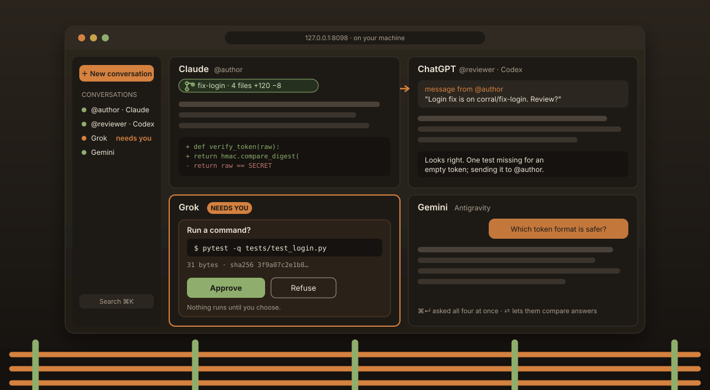

<p align="center">
  
</p>

<h1 align="center">Corral Light</h1>

<p align="center"><strong>Every AI assistant you pay for, on one wall, behind one gate you hold.</strong></p>

<p align="center">
  <a href="#install-in-one-line-linux"></a>
  
  
  
  <a href="LICENSE"></a>
</p>

<p align="center">
  
</p>

---

## The problem you already have

You pay for more than one AI assistant. Claude for code, ChatGPT for a
second opinion, maybe Grok or Gemini because each is good at something the
others are not. They live in four apps, four tabs, four terminals, and none
of them can see the others. You copy an answer out of one and paste it into
the next. You are the message bus.

And the coding agents among them do things now. They edit files, run
commands, commit. Each vendor has its own idea of what "ask first" means,
and two agents in the same repository will cheerfully overwrite each other.

## What Corral Light does about it

Corral Light is a small server that runs on your own computer and puts all
of your assistants **side by side in one browser tab**, the wall, signed in
with the accounts you already have. No API keys. No cloud relay. No vendor
in the middle. Each assistant talks only to its own maker, as you.

Every assistant on the wall runs **behind the same fence**. Before any of
them writes a file or runs a command, its pane stops and shows you exactly
what it wants to do, down to the byte, with a digest of the request. You
approve it or you refuse it. The server enforces this, so no browser trick
and no chatty model can skip it.

Then the assistants can finally work *together*:

- **Ask all of them at once.** One prompt to every pane (⌘↵ / Ctrl+Enter),
  then **⇄ Cross-feed** hands each one the others' answers for a second
  round. Disagreements surface in seconds, not after three copy-pastes.
- **Let them talk to each other.** Name a pane `@author` and another
  `@reviewer`. The author can send its work to the reviewer and wait for an
  answer, with hard limits so two agents can never loop forever. When an
  agent needs *you*, the pane says **needs you** instead of burying a
  question at the end of a reply.
- **Give each agent its own branch.** Tick **Own branch** and the agent works
  in its own git worktree on `corral/<name>`. Your checkout is never
  touched. When it is done you review the diff, then Commit, Push, open a
  pull request, or Discard, and Discard keeps a recovery copy.
- **Second opinions without a second bill.** Any assistant, or any script,
  can run `corral-light consult ask --lane grok --prompt "…"` and get an
  answer through your Grok subscription, in a pane you can watch.
- **Bring the whole team back.** Save your named panes as a **rig** and
  restore them all with one command tomorrow.

Underneath sits [AI-OS Seed](https://github.com/cvp1/ai-os-seed), the floor:
scheduled jobs, a run log, a secrets vault, and a memory that remembers
*why* you decided things. The installer sets up both. This README covers the
wall; Seed has its own.

### Who it is for

You will like Corral Light if you use AI assistants for real work, pay for
at least one of them, and want them to cooperate without handing your
repository, your keys or your judgment to someone else. You do not need to
be a terminal expert: the installer is one pasted line, and it was built
for someone who has never opened a terminal. You do need a Linux desktop
today; macOS works by hand (see below).

| Works with | You need |
|---|---|
| **Claude** (Claude Code) | Claude Pro or Max |
| **ChatGPT** (Codex) | ChatGPT Plus, Pro or Team |
| **Grok** | SuperGrok or X Premium |
| **Gemini** (Antigravity) | A Google account |
| **Local models** (Ollama) | Ollama and one model; chat only |

---

## Install in one line (Linux)

Open a terminal (Ctrl+Alt+T on most desktops) and paste:

```
curl -fsSL https://raw.githubusercontent.com/cvp1/corral-light/master/install.sh | bash
```

<sub>No `curl`? `wget -qO- https://raw.githubusercontent.com/cvp1/corral-light/master/install.sh | bash` does the same.</sub>

Here is what happens, start to finish:

1. **Two questions, before anything is installed.** Which assistants you
   have an account for (press Enter for Claude only), and whether Claude may
   remember your past conversations.
2. **About five minutes on its own.** Twenty if you picked Gemini, which is a
   1.5 GB download. It installs everything into your home folder; it asks for
   your password only if a basic tool such as `git` is missing, and shows
   you the command first. Nothing shows while you type a password; that is
   normal.
3. **One sign-in per assistant.** Each opens its own login in your browser
   (or prints a device code with no display). Skip any of them and come
   back later.
4. **The wall opens.** Your browser lands on Corral Light, already paired.
   Start typing.

Running the same line again is always safe: it updates what moved, repairs
what is missing, and never installs anything twice. That is also how you
**update**.

### What you need

| | |
|---|---|
| **A Linux computer** | x86-64 or arm64: Ubuntu, Debian, Fedora, Arch, openSUSE. A desktop, so a browser can open. |
| **An account** | At least one of the assistants above. You can skip any sign-in and add it later. |
| **Disk** | About 600 MB; 2.1 GB with Gemini. |
| **Your password** | Only if `git`, `python3`, `curl` or `cron` is missing. The installer uses your distribution's own package manager and nothing else. |

<details>
<summary><strong>Exactly what the installer does, step by step</strong></summary>

| | Step | What it checks, then does |
|---|---|---|
| 1 | **The ground** | Confirms Linux, your CPU, glibc and a desktop. Refuses to run as root. Then asks its two questions, before anything is installed or downloaded. |
| 2 | **Tools** | Installs any missing base tools with your package manager, after showing you the command. Checks the internet and free disk space. |
| 3 | **Posts** | Clones this repo to `~/tools/corral-light` and AI-OS Seed to `~/tools/ai-os-seed`, each at a pinned version. Puts the `corral-light` command on your PATH. |
| 4 | **Node** | A private copy of Node.js (checksum verified) in `~/.local/share/corral-light/node`. Your system's Node, if any, is not touched. |
| 5 | **Rails** | The Claude and ChatGPT adapters, from the lock file (`npm ci`). |
| 6 | **The herd** | Claude Code (a pinned version through Anthropic's own installer, which verifies the binary; it then keeps itself current), the Grok CLI (pinned, into a private prefix), and the Antigravity runtime for Gemini (pinned, checksum verified) if you chose it. |
| 7 | **The floor** | AI-OS Seed into `~/aios`: selftests, the demo job through the real run logger, your `CLAUDE.md` through Seed's stage-then-approve gate, the memory mesh, the memory hooks if you said yes, the scheduler synced to cron, then Seed's post-install audit. On a re-run each piece is checked separately, so a run that stopped halfway finishes next time. |
| 8 | **Lights on** | Refuses a port another program holds. Installs Corral Light as a **user** service (systemd), starts it, keeps it alive across logout, enables the watchdog timer, and waits for a hub that identifies itself as Corral Light. |
| 9 | **Sign-ins** | Each assistant's own login, one at a time. Each opens your browser, or prints a device code if there is no display. Any can be skipped. |
| 10 | **The gate** | Opens the wall in your browser, already paired (`corral-light launch`). |
| 11 | **The brand** | Writes a receipt with every version actually installed, and prints what is done and what is still to do, per assistant, with the exact command for each. |

Everything it prints also goes to `~/.local/share/corral-light/install.log`,
and the versions it installed, down to the git commit, go to
`install-receipt.json` beside it.

**What is pinned.** Seed's tag, Node, the two adapters (lock file), the Grok
CLI and the Antigravity runtime are pinned, and checksum-verified where a
checksum exists. Corral Light itself installs from `master` unless you set
`CORRAL_LIGHT_REF` to a commit; the commit used is in the receipt. Claude
Code is installed at a pinned version through Anthropic's installer and then
updates itself, which is Anthropic's policy, not ours.
</details>

<details>
<summary><strong>Choosing what to install</strong></summary>

The one-liner asks which assistants you have; Enter means Claude only. To
decide up front, download the script and pass options:

```
curl -fsSLO https://raw.githubusercontent.com/cvp1/corral-light/master/install.sh
bash install.sh --lanes claude,grok          # just these two
bash install.sh --workspace ~/work/aios      # Seed somewhere other than ~/aios
bash install.sh --skip-logins                # sign in later (see below)
bash install.sh --yes                        # no questions: all four assistants, memory on
bash install.sh --help                       # every option, and every version it pins
```
</details>

<details>
<summary><strong>If something goes wrong</strong></summary>

The installer stops at the step that failed, says which one, and points at
the log. Fix what it names and run the same line again. After that:

```
corral-light doctor              # which assistants are ready, and why not
corral-light diagnose claude     # one full conversation, with every error shown
journalctl --user -u corral-light -n 50   # the hub's own log
```
</details>

**Uninstall:** `bash ~/tools/corral-light/install.sh --uninstall` asks
before each thing it removes. Your sign-ins and your files are never part of
it.

---

## Your first twenty minutes

### 1. Open a conversation

The browser tab the installer opened is **the wall**. Closed it?
`corral-light launch` opens it again, already paired.

Click **＋ New conversation**, pick an assistant, choose a folder (the
default is `~/aios`), and type. The **⚡** button beside it starts your
default assistant in one click; right-click it to change the default.

### 2. Meet the gate

Ask a coding assistant to do something real, such as *"add a test for the
login helper and run it."* When it wants to write the file or run the
command, the pane turns **needs you** and shows the exact request: the
command or the file contents, its size in bytes, and a SHA-256 digest.
Choose one of the options the assistant offers. Nothing happens until you
do, and a request too large to show in full cannot be approved at all.

### 3. Ask everyone

Open a second assistant beside the first. Type a question in one pane and
press **⌘↵** (Ctrl+Enter on Linux): every pane that can take a prompt gets
it. When the answers are in, press **⇄ Cross-feed** in the sidebar and each
assistant reads the others' answers for round two.

Press **⌘K** (Ctrl+K) to search every open and archived conversation, plus
your notes, and attach a result to the message you are writing. Press **?**
for every keyboard shortcut.

### 4. Give an agent its own branch

Open a new conversation in a folder inside a git repository and tick **Own
branch**. The agent gets a fresh worktree on a new `corral/<name>` branch,
cut from the branch you are on; your checkout and its uncommitted changes
stay exactly as they are. (On Linux, Claude, Codex and Grok can take an own
branch. If the repository cannot, the row says why.)

The pane header shows what changed, such as `fix-login · 4 files +120 −8`.
Click it, or press **r** on the focused pane, to review. Review freezes a
snapshot, and every action applies to exactly what you saw:

- **Commit** records the files shown on the branch.
- **Push** sends it to the remote you pick, showing the exact URL first. It
  never force-pushes, and it can open a GitHub pull request with `gh`.
- **Discard** stops the agent, saves everything as a recovery ref, and moves
  the folder to trash. Nothing is deleted for good until you type the branch
  name with `corral-light worktrees purge`.

An own branch keeps agents from colliding; it is not a sandbox. An agent
with a shell can still write anywhere you can.

### 5. Put two agents to work together

Open a pane's **⋯** menu and choose **Give it a seat…** to name it, such as `@author`,
and do the same for a second pane, `@reviewer`. Now tell the author: *"when
you are done, send your change to @reviewer and wait for the review."* The
agents use built-in tools to message each other; you watch both panes and
still approve every write. Save the pair with `corral-light rig save
pairing` and bring both back tomorrow with `corral-light rig up pairing`.

### 6. Drive it from a terminal

Everything the wall does, a terminal can do, and panes opened there appear
on the wall:

```
corral-light panes                               # what is open and what it is doing
corral-light open --lane grok --cwd ~/src/app    # new pane, prints its id
corral-light say <pane> "review the diff"        # send, and stream the reply
corral-light consult ask --lane codex --prompt "Is this migration safe?"
corral-light doctor                              # which assistants are ready
```

Point your own assistant at `corral-light consult` in its instructions file,
and every second opinion it asks for goes through a subscription you already
pay for.

### 7. Take it with you

The hub listens only on your own computer. To reach the wall from your phone
or a laptop, put [Tailscale](https://tailscale.com) Serve or an SSH tunnel in
front of it; both are covered under [Security](#security).

---

## Signing in later

Each assistant signs in with its own tool, as you, and keeps its own
credential. Corral Light never sees a password or a token.

| Assistant | Command |
|---|---|
| Claude | `claude auth login` |
| Grok | `grok login` (or `grok login --device-auth` with no display) |
| ChatGPT | `CODEX_HOME=~/.config/corral-light/codex-home ~/tools/corral-light/spike/node_modules/.bin/codex login` |
| Gemini | Open a Gemini conversation on the wall; the Google sign-in opens the first time. |

`corral-light doctor` tells you which ones are done.

## Honest limits

- **Linux first.** The one-line installer is for Linux. macOS works by hand
  (below); own branches are not yet approved for any macOS lane.
- **Not a sandbox.** The gate covers every request an assistant makes
  through its tools. An agent with shell access runs as you, and Codex's
  own sandbox auto-approves commands inside its working folder.
- **Gemini runs without asking** in its current runtime, whatever posture
  you choose, so it is held back from own branches.
- **Ollama is chat only.** It cannot edit files or run commands.
- **Your machine, your uptime.** The hub runs as a user service; if the
  machine sleeps, so does the wall.

<details>
<summary><strong>Install by hand (any Linux, or macOS)</strong></summary>

You already have Claude Code, Python 3.9+ and Node.js 20+.

One folder: `~/aios`. Seed lives in it. This app looks at it. A second folder is a second brain.

1. Install Seed into `~/aios` (or `--into` a workspace you already have; that folder then *is* `~/aios` for this purpose). See the Seed README. Do not install Seed into this repo.
2. Clone this repo, then:
   ```
   cd spike && npm install && cd ..    # the Claude and ChatGPT adapters
   ./corral-light doctor
   ./corral-light serve
   ```
   The adapters for Claude Code and ChatGPT (Codex) are an npm package, and
   `spike/node_modules/` is gitignored, so no clone arrives with them. Skip
   this step and those two lanes report `not installed: …/spike/node_modules/.bin/claude-agent-acp`.
   `doctor` names the step if the directory is missing. The other three lanes
   (Grok, Antigravity, Ollama) resolve their programs outside this tree.
   Then either `./corral-light launch` (opens the browser, paired), or open
   http://127.0.0.1:8098 and in another terminal run `./corral-light pair <code>`
   with the code on screen.
3. New Claude conversation. Working directory = `~/aios`.
4. Done when `/status` answers.

The server runs in the foreground. Data lives at `~/.local/share/corral-light`, not in `~/aios`, and not in this clone. `doctor` lists the assistants that are ready and explains what is missing for the others.
</details>

---

## Reference

Everything past the gate. Each section stands on its own.

| | |
|---|---|
| **The herd** | [Supported assistants](#supported-assistants) · [Keeping them current](#keeping-the-assistants-current) |
| **Working the wall** | [Search and attach files](#search-and-attach-files) · [Passing work between assistants](#passing-work-between-assistants) |
| **Seats and rigs** | [Seats: panes that can message each other](#seats-panes-that-can-message-each-other) · [Asking the human](#asking-the-human) · [Rigs: bring your seats back](#rigs-bring-your-seats-back-with-one-verb) |
| **The fence** | [Security](#security) · [Configuration](#configuration) |
| **Keeping it running** | [Run in the background](#run-in-the-background) · [Watching the hub](#watching-the-hub) · [From the command line](#from-the-command-line) |
| **When it limps** | [Troubleshooting](#troubleshooting) · [Development](#development) |

## Supported assistants

Corral Light connects to software installed and signed in on your computer.

| Assistant | What you need | Notes |
| --- | --- | --- |
| Claude Code | Claude Code, and the adapter from `cd spike && npm install` | Supports model and effort selection. |
| ChatGPT (Codex) | The same npm install, plus a Codex login | Uses a separate configuration directory. |
| Grok | The Grok command-line tool and `grok login` | The Grok tool manages its own sign-in. |
| Antigravity (Gemini) | Run `python3 install_antigravity_acp.py --install` | The included installer supports Linux x86-64, Linux arm64, and macOS on Apple Silicon (Google publishes no Intel-Mac build). It also selects your Google login (`oauth-personal`) in `~/.gemini/antigravity-acp/settings.json` when no sign-in method is set; a method you chose yourself is left alone. |
| Ollama | Ollama and at least one downloaded model | Chat only; it cannot edit files or run commands. |

The availability check is intentionally honest: an assistant is marked unavailable when a required program, login, or platform is missing. If an assistant passes that check but fails to answer, run:

```
./corral-light diagnose [assistant]
```

### Keeping the assistants current

```
./corral-light lanes check             # installed against latest, every lane; changes nothing
./corral-light lanes update codex      # or claude; gemini --release <name>; grok
```

`lanes check` reports each assistant as `current`, `behind`, or `unknown`. A check that cannot get an answer says `unknown`, never `current`. Antigravity has no release list, so the check asks for each day's first build after the pinned one; finding none is still `unknown`. Run on a schedule with `--job`, it notifies once when an assistant falls behind and once when it is current again, and says nothing while all are current.

An update is proven before anything moves. The newer adapter is installed into a scratch directory and started on a private hub with its own state and port. It has to complete a handshake, answer one real prompt, and report its model list. Only then does it replace `spike/node_modules`, and only one pin in `spike/package.json` and its lock changes (or, for Antigravity, this platform's row in the installer). If any step fails, nothing changes and you get a notification. The running hub and its panes are never touched: new panes start on the new adapter. The replaced tree goes to the Trash. Grok's own tool installs Grok updates, so for Grok this only reports and probes. Google publishes no list of Antigravity releases, so you name the release.

## Search and attach files

Press `⌘K` to search open conversations, archived conversations, notes, and other configured text files. Press `?` for every keyboard shortcut — that list is generated from the same table the key handler dispatches from, so it cannot advertise a key that does nothing.

By default, Corral Light searches `~/notes` when that directory exists. Add other directories in `~/.config/corral-light/content.json`:

```json
[
  {"key": "notes", "label": "Notes", "root": "~/notes"},
  {"key": "documents", "label": "Documents", "root": "~/Documents"}
]
```

The search index includes Markdown and plain-text files. It skips hidden directories and `node_modules`, refuses symlinks that leave the configured directories, and applies limits to the number and size of indexed files. The SQLite index is temporary derived data and can be deleted; it will be rebuilt from your files.

When you attach a search result:

- Coding assistants receive the file path and must open it through their normal approval flow.
- Chat-only assistants receive a bounded quoted excerpt.

Nothing is sent until you review the composer and press send.

Manage the index from a terminal:

```
python3 content.py status
python3 content.py search "your query"
python3 content.py refresh
```

## Passing work between assistants

Five ways to move work across panes, and when each one fits: attach a note,
quote one pane's answer into another, fan one prompt out to every pane (⌘↵),
cross-feed the answers so they argue (⇄), or ask an assistant to consult
another one itself. The guide, with the panel recipe and the rules that hold
in every case: [`docs/PASSING-WORK.md`](docs/PASSING-WORK.md).

An assistant (or any script) can do the last one through the wall instead of
through a vendor API: `corral-light consult ask --lane grok --prompt "…"`
opens a pane on that lane, waits for the answer, and prints it as JSON —
on the subscription the lane is already signed in with, in a pane you can
watch and answer. `consult lanes` lists what is live; `fanout` and
`crossfeed` are the ⌘↵ and ⇄ buttons from a script. Point your assistant at
it once in its instructions file ("to ask another model, use `corral-light
consult`, never an API key by default") and second opinions stop costing a
second bill.

## Seats: panes that can message each other

A **seat** is a name you give a pane — `@reviewer`, `@author` — with the ＠ in
its header (or `corral-light seat <pane> <name>`; `-` removes it). One open pane per name; a closed pane holds nothing. Once a pane
has a seat, the agent in another pane can reach it through tools Corral
offers every eligible pane (an MCP server named `corral-seats`):

- `seat_list()` — who can be addressed and what state each is in (`your-turn`,
  `working`, `needs-you`, `paused`, …). No titles, no transcripts.
- `seat_send(seat, text)` — one message, answered `delivered` (with a turn id),
  `refused` (with the reason), `failed`, or — only in the one case below —
  `queued`.
- `seat_broadcast(text)` — the same message to every other seated pane, one
  `seat_send` per seat: a list of answers, one per seat. A refusal for one seat
  does not stop or undo the others; each seat counts as one send against the
  hourly limit; at most 12 seats are tried and any beyond are reported, not
  skipped.
- `seat_wait(seat, turn | until, timeout_s)` — wait until another seat is done,
  instead of polling `seat_list`: with the `turn` a `seat_send` returned, until
  that message's turn ends; with `until`, until the seat shows `your-turn`
  (also met by `idle`), `idle`, `needs-you` or `dead`. Bounded — 120 s by
  default, 600 s at most — and one wait at a time per pane. It answers with the
  seat's state and whether the turn ended, **never with what the other agent
  wrote**: a reply comes back only as a message that agent chooses to send. A
  paused or dead seat ends the wait `blocked`; a hub restart ends it
  `interrupted`. The waiting happens in the pane's own tool process, never in
  the hub. **A waiting pane is working**, so a message sent to it while it
  waits is refused `busy` — with one exception: the reply from the very seat
  it is waiting on, sent during the turn it is waiting on, is **queued** and
  arrives as the waiting pane's next turn once its current turn ends (below).

A message arrives in the other pane as its own block, marked **from @author**
and **untrusted** — never as that pane's human, never lifting a runbook park.
A message that claims *your* approval or decision ("the user approved it",
or your name, taken from the account's full name) is delivered with a hub
line saying the claim is unverified and only your own turn can give it. The
line also appears on the block. It is a flag, never a refusal.
It is refused, not queued, when the target is busy, waiting on a permission
card, paused (after a restart every pane is), or dead. After **four** messages
pass between panes with no human turn on them, sending stops until a human
speaks. Each pane may try **30** sends an hour; refusals count.

**The one queue: a reply to a pane that is waiting on you.** If @author is in
`seat_wait` on the turn @reviewer is running, @reviewer's `seat_send` to
@author answers `queued` (naming the turn it waits behind) — not `delivered`:
nothing has reached @author yet. When @author's turn ends, the message goes
through every check again (card, runbook park, paused, the four-message chain,
the data gate) and is either delivered as @author's next turn or recorded as
refused. It is bounded four ways:

- **one** queued message per pane (`PEER_QUEUE_MAX`); a second is refused
  `queue-full`, with no hint to retry;
- **600 s** at most (`PEER_QUEUE_TTL_S`, the longest a wait can be); after that
  it `expired`;
- the **same size and envelope checks** as any `seat_send`, at the time it is
  queued;
- **memory only**: closing, cancelling, pausing or losing @author's agent, or
  restarting the hub, drops it. Nothing is saved or re-sent.

Every outcome — queued, delivered, refused, expired, dropped — is written into
**both** panes' transcripts. Anyone else sending to a waiting pane is still
refused `busy`.

**What the sender label is, and is not.** The hub decides who sent a message
from a token it mints for each pane at every spawn and keeps only in memory.
That token is a label for the supported path, **not a secret**. Some adapters
put it on a process command line (the Claude adapter does), where any local
user can read it — so on Linux the hub also checks, from `/proc/net/tcp`, that
the calling process belongs to the hub's own UNIX user, and refuses anything
else (including a caller it cannot identify). On other platforms that check is
not made. Within that boundary, any process running **as the same user** can
send as a pane, and an agent with a shell could already type into any pane
through the local API. Seats add provenance and a gate to the path agents are
meant to use; they do not create an identity a same-user process cannot forge.

**Who can send.** Every lane whose adapter accepts MCP servers is offered the tools. The Ollama lane's adapter takes none, so a pane there can **receive** a message but not send one; SSH panes neither send nor receive. `seat_list` says which panes were offered the tools. `CORRAL_NATIVE_MCP=0` in the hub's environment turns the
tools off for every pane.

## Asking the human

An agent that needs your decision cannot raise it by writing a question at the
end of its reply: a reply that ends in a question looks exactly like a pane that
simply finished, and nothing tells you. So every pane that is offered the seat
tools also gets **`ask_human(question)`**. Its description tells the model to
use it whenever it needs your decision, answer or attention, and then to end its
turn — prose alone raises nothing.

- **What you see.** The pane reads **needs you** (in the roster, on the pane,
  on a minimized chip, and in the tab title's count), the roster row carries an
  `asks: …` preview, and a banner with the full question sits between the
  pane's header and its transcript. The transcript records it as the agent
  asking — never as your message, never as a system instruction.
- **One open question per pane.** Asking again replaces the earlier question
  (the transcript says so). A question is at most **2000** characters
  (`MAX_ASK_CHARS`); a longer one is refused, never cut. The tool can only ask
  on its own pane: the hub decides which pane is asking from the pane's token,
  never from anything the model sends.
- **What answers it.** Any turn you send the pane — typed, or from the command
  line or a script — closes it. A message from another pane's agent, or a
  rig's opening prompt, does **not**. Closing the pane or its agent stopping
  also closes it; the transcript says which.
- **A loop that hits the message limit raises itself.** When a message between
  panes is refused at the four-message limit (a direct send, a broadcast, or a
  queued reply at delivery), Corral itself opens a question on the **sending**
  pane — "Loop paused … Refused: @sender → @target" — marked as Corral's, never
  the agent's. It reads needs you like any question and closes on your next
  message to that pane, which also restarts the count for **both** panes so the
  loop can carry on. If that pane's agent already has its own question open, it
  is left alone (the pane already needs you) and only the refusal is recorded.
  The other pane is not flagged: one item per stall.
- **Restarts.** The open question is saved with the pane's metadata, so it
  survives a hub restart: the pane comes back paused and still reads needs you.
- **Turns you did not start.** When a turn that another pane's agent or a rig
  started ends, the pane reads **idle**, not **your turn** — you did not start
  it, so nothing is waiting on you. An agent that does need you uses
  `ask_human`.
- The same boundary as the seat tools applies: any process running as the hub's
  own user could call the route as a pane, or send a turn that closes a
  question.

## Rigs: bring your seats back with one verb

A **rig** is your seated panes, saved by name: `rigs/<name>.toml` in the state
directory, one `[[seat]]` per pane — seat name, lane, directory, and the
pane's permission mode and role if it has them. A template with every key
explained ships at `corral_core/rig.example.toml`.

```
./corral-light rig save <name> [--replace]   # every seated pane on the roster
./corral-light rig up <name>                 # one line per seat; exit 1 if any seat did not come up
./corral-light rig list
./corral-light rig rm <name>
```

The same four verbs are in the browser: **Rigs…** in the New dialog, or ⌘K
and type `rig`. The dialog lists your rigs with **Up** and **Remove** (two
clicks; a removed rig has no undo), saves the seated panes under a name, and
shows the server's outcome line for each seat — the same lines `rig up`
prints.

**`up` checks the whole rig first, and starts nothing if any seat is wrong**:
a file that does not parse, the wrong `version`, a bad seat name, an unknown
lane or key, a directory that does not exist, more seats than the live pane
cap, a seat named twice, a role that does not resolve, or a seat that is
already live. Every reason is listed. Then each seat, in file order, gets
exactly one outcome:

| Outcome | What is now true |
|---|---|
| `resumed` | an open pane held the seat, and its lane reloaded the conversation |
| `rebuilt` | an open pane held the seat; its transcript is back, but the lane could not reload the conversation (or says the model starts fresh) |
| `started-fresh` | nothing held the seat: a new pane, seated |
| `fresh-primed` | …and the rig's opening prompt was sent to it |
| `withheld` | another pane took the seat after the check |
| `not-restored` | the pane cap would be exceeded, or the pane holding the seat is on disk but not on the roster |
| `failed` | the pane could not be started or resumed — the reason is on the line |

Nothing rolls back: a seat that fails does not undo the ones before it. Each
pane a rig touched also gets a note in its transcript saying what the rig did.

**An opening prompt is yours.** `save` never writes one. If you add
`prompt = "..."` to a seat by hand, `up` sends it as that pane's first turn —
through the same path as typing it, marked `via rig` — and only to a pane it
started; a resumed conversation is never re-prompted. With a `role`, the
role's instructions go ahead of the prompt, as a role's first turn always
does; a role with no prompt sends nothing. Prompts are capped at 8,000
characters, a rig at 12 seats.

## Own branches: one agent, one git branch

Two panes on one repository normally share one working tree, so two agents
can overwrite each other's files. Tick **Own branch** in the New dialog and
the pane gets its own git worktree on a new branch, `corral/<name>`, cut from
the branch your checkout is on. Your checkout is not touched: its uncommitted
changes stay where they are, and the dialog says so. The row appears only
when the folder is inside a git repository and the lane can use it. Lanes
are approved per platform, from a test run on that platform: on Linux,
Claude, Codex and Grok; on macOS, none yet. Gemini is held back everywhere
because its lane runs without asking whatever the posture. (Grok asks under
`strict`; under `auto` its launcher passes `--always-approve`, so it runs
without asking by your choice, not the lane's.) When the repository cannot take one (no commits yet,
on tmpfs, submodules, a sparse checkout, Git LFS without git-lfs, git older
than 2.38), the row says why instead of offering the box.

The pane's header shows the branch and what changed, e.g.
`⎇ fix-login · 4 files +120 −8`. The line counts are for tracked files; new
files count as files. Click it, or press `r` on the focused pane, to review.
When the agent finishes a turn with changes you have not reviewed, a card
says so in the rail. It never counts as blocked, and on a phone it does not
pop the rail open.

**Review freezes what you see.** Opening review takes a snapshot of the
worktree. Commit, Push and Discard act on exactly that snapshot; if a file
changed since (the agent, a background process, you), the action is refused
and the review refreshes to show the current files.

- **Commit** commits the files shown, with `git commit-tree`: the
  repository's commit hooks (pre-commit, commit-msg) do not run. Pre-push
  hooks still run when you push.
- **Push** sends the committed branch to the remote you pick. It needs
  exactly one push URL, which is shown before you press it, and never
  force-pushes. For a GitHub remote it can open a pull request with `gh`, or
  give you the compare link when `gh` is missing.
- **Copy merge command** copies `git -C <repo> merge --no-ff corral/<name>`
  for merging into your own branch yourself.
- Untracked files over 512 KiB are left out of review and commit, named in a
  banner, and block Push until you move them or add them to `.gitignore`.
  Ignored files are never in a review; Discard keeps them in trash.

**It is not a sandbox.** A worktree is a separate checkout, not a sandbox. An
agent with shell access can still write anywhere you can, by absolute path.
Own branches prevent accidental collisions between agents; they do not
confine a hostile one. When an agent's file-edit tool touches a path outside
its worktree, its turn is stopped and you are told which path. Shell commands
usually report only their working folder, so a shell command writing
elsewhere is not caught; Codex reports no paths at all, and its own sandbox
is the guard there.

**Nothing here deletes your work without a typed confirmation.**

- **Discard** stops the agent, saves everything (untracked files included) as
  `refs/corral/recovery/<id>/<time>` in your repository, and moves the whole
  worktree, ignored files too, into `<root>/.trash/`. The branch stays.
- **Close** keeps the worktree; reopening the conversation brings it back.
- `corral-light worktrees restore <id>` moves a discarded worktree back, and
  the pane resumes there.
- `corral-light worktrees purge <id>` deletes a discarded worktree for good.
  You type the branch name. It deletes the trash folder, and the branch only
  if it has not moved since discard. Recovery refs are never deleted; remove
  one yourself with `git update-ref -d <ref>` when you are sure.
- After a restart, a worktree that is missing or was changed underneath
  Corral is reported, never repaired. An action cut short (commit, push, pull
  request, discard) is finished by checking git, or marked "outcome unknown",
  which blocks the pane until you settle it with
  `corral-light worktrees resolve <id>`.

```
./corral-light worktrees                       # every worktree, its pane, its way out; writes nothing
./corral-light worktrees list --json
./corral-light worktrees restore <id>
./corral-light worktrees purge <id>            # asks for the branch name (or --confirm <branch>)
./corral-light worktrees resolve <id> [--op <op_id>]
./corral-light doctor                          # git version, where worktrees live, trash size
```

Worktrees live in `~/.local/share/corral-light/worktrees` (beside the
registry, never inside the repository). `CORRAL_LIGHT_WORKTREES` moves them;
it must be on disk, not tmpfs.

## Security

The server listens only on your computer by default (`127.0.0.1`). To use it from another computer, create an encrypted SSH tunnel:

```
ssh -N -L 8098:127.0.0.1:8098 user@example.com
```

Or, from your phone on a [Tailscale](https://tailscale.com) tailnet, put Tailscale Serve in front of it — real HTTPS, tailnet-only, no open port:

```
tailscale serve --bg 8098                       # https://<machine>.<tailnet>.ts.net → 127.0.0.1:8098
CORRAL_TAILSCALE_LOGIN=you@example.com ./corral-light serve
```

With `CORRAL_TAILSCALE_LOGIN` set, a request that arrives through Serve must carry that tailnet identity (Serve stamps it and strips any forged copy); proxied traffic with no identity — Funnel, a tagged device — is refused; requests on the machine itself are unchanged. The session cookie is marked `Secure` when it is minted through Serve, and an open event stream re-checks its cookie every 30 seconds and closes itself when the cookie expires. Pairing still needs a shell on the machine — that is the point. `corral-light launch` is the same proof in one step: it mints a code, approves it as the account that owns the hub, and opens `/#pair=<code>` in the local browser — in the fragment, so the code is never sent in a request; the page claims it once (single use, five minutes) and removes it from the address bar. A browser on another machine still needs `corral-light pair`. What this does not do: separate the approval authority from the assistant's own UNIX user; anything running as you can still pair itself. (`corral_core/edge.py`, contract in `corral_core/test_edge.py`.)

When an assistant asks to write a file or run a command, Corral Light pauses it and shows the exact request, byte count, and SHA-256 digest. Requests too large to display cannot be approved. The browser cannot bypass this check because the server enforces it.

Corral Light removes common provider credential variables from assistant processes by default. This prevents a shell environment from silently changing which account an assistant uses. To intentionally allow those variables through, set:

```
CORRAL_LIGHT_ALLOW_VENDOR_ENV=1
```

Diagnostic output includes command names, configuration details, environment variable names, connection results, and assistant error messages. It never prints credential values.

## Configuration

| Variable | Default | Purpose |
| --- | --- | --- |
| `CORRAL_LIGHT_BIND` | `127.0.0.1` | Network address for the local server. |
| `CORRAL_LIGHT_PORT` | `8098` | Web interface port. |
| `CORRAL_LIGHT_STATE` | `~/.local/share/corral-light` | Saved conversations, history, and session security data. |
| `CORRAL_OLLAMA_URL` | `http://127.0.0.1:11434` | Ollama server address. |
| `CORRAL_CLAUDE_ADAPTER` | `spike/node_modules/.bin/claude-agent-acp` | Claude adapter location. |
| `CORRAL_CONTENT_CONFIG` | `~/.config/corral-light/content.json` | Directories searched by `⌘K`. |
| `CORRAL_NODE_BIN` | An available Node.js installation | Optional Node.js path override. |
| `CORRAL_LIGHT_URL` | `http://127.0.0.1:8098` | Where `corral-light consult` finds the hub. |
| `CORRAL_LIGHT_CONSULT_CFG` | `~/.config/corral-light/consult-session.json` | The paired session `consult` keeps (0600). |
| `CORRAL_LIGHT_WORKTREES` | `<state>/worktrees` | Where own-branch worktrees live. Must be on disk, not tmpfs. |
| `CORRAL_LIGHT_WORKTREES_ENABLED` | `1` | `0` refuses new own-branch panes; existing ones still resume and can be discarded. |
| `CORRAL_LIGHT_WORKTREE_LANES` | Linux: `claude,codex,grok`; macOS: none | Lanes allowed an own branch; setting it overrides the per-platform list. |

The default address is local-only by design. If you change `CORRAL_LIGHT_BIND` to expose the server on a network, protect access with your network controls and pairing code.

## Run in the background

```
./corral-light install-service --print   # show the file, write nothing
./corral-light install-service           # write it, and print how to start it
```

This writes a systemd user unit (Linux) or a launchd agent (macOS) with every
path resolved from the checkout that is running — the interpreter, the working
directory, and the log path. It **does not enable and does not start
anything**: writing a file is reversible, and starting a daemon that holds a
port and spawns assistants with your filesystem access is your decision. The
exact enable command is printed for you to run. An existing file is left alone
unless you pass `--force`.

The repository also ships the two files as templates (`corral-light.service`,
`com.cvp1.corral-light.plist`) if you would rather edit them by hand.

Do not run the service as root; assistants need the permissions and sign-ins
of the user who starts them. Do not point a service at a worktree —
`spike/node_modules/` is gitignored, so a worktree has neither vendor adapter
and both those lanes go dark in a way that looks like a vendor outage.

The systemd unit uses `KillMode=mixed`: on a stop or restart the hub is signalled first and writes one note in every pane that had a turn running, naming the interrupted message and anything queued behind it. Nothing is re-sent automatically. If an agent process outlives the hub anyway (launchd), the next start stops it before any conversation is resumed.

## Watching the hub

`corral-light watch` checks the hub from outside it: it reads `/health`, judges how long ago the hub last checked its panes, and checks that the hub process is alive. When something is wrong it **pages** — it writes the reason to `~/.local/share/corral-light/DEAD` and shows a desktop notification (`notify-send` on Linux, `osascript` on macOS; never between 21:00 and 05:00, never over the network). It **never restarts** the hub, because a restart ends every running conversation; that decision stays with you. It notifies once per new problem and removes `DEAD` when the hub is healthy again. Exit status: 0 healthy, 2 paged.

Linux, every ten minutes:

```
sed "s|%HERE%|$PWD|" corral-light-watch.service > ~/.config/systemd/user/corral-light-watch.service
cp corral-light-watch.timer ~/.config/systemd/user/
systemctl --user daemon-reload && systemctl --user enable --now corral-light-watch.timer
```

macOS: save as `~/Library/LaunchAgents/com.cvp1.corral-light-watch.plist` (fix the two paths), then `launchctl load` it:

```xml
<?xml version="1.0" encoding="UTF-8"?>
<!DOCTYPE plist PUBLIC "-//Apple//DTD PLIST 1.0//EN" "http://www.apple.com/DTDs/PropertyList-1.0.dtd">
<plist version="1.0">
<dict>
  <key>Label</key><string>com.cvp1.corral-light-watch</string>
  <key>ProgramArguments</key>
  <array>
    <string>/opt/homebrew/bin/python3</string>
    <string>/path/to/corral-light/watch.py</string>
  </array>
  <key>StartInterval</key><integer>600</integer>
  <key>RunAtLoad</key><true/>
</dict>
</plist>
```

The hub itself also notifies you — on a permission request or an agent that stopped — when no open, focused browser tab has shown that pane's event within 20 seconds. Same quiet hours, same no-network rule.

## From the command line

Everything the browser does with a pane, a terminal can do too, on every lane — the commands talk to the running server exactly as the browser does, so a pane opened here appears on the wall and keeps its permission rail:

```
./corral-light launch                              # open the wall in your browser, already paired
./corral-light panes                               # list panes: state, lane, model, waiting cards
./corral-light open --lane grok --cwd ~/src/app    # prints the new pane's id
./corral-light say <pane> "review the diff"        # sends, streams the reply
./corral-light watch <pane>                        # follow a pane live
./corral-light pending <pane>                      # every waiting card, in full, with its digest
./corral-light ok <pane> [n] | no <pane> [n]       # answer a card
./corral-light cancel|pause|resume|close|forget|reopen <pane>
./corral-light rename <pane> <title> · config <pane> <id> <value>
./corral-light attach <pane> <note-id> · quote <from> [<to>]
./corral-light rig save|up|list|rm <name>           # saved seats (see Rigs)
```

`say` waits for as long as the turn takes. When the pane needs you it prints the whole request — the same bytes the approval's digest covers — and takes `ok`, `no` or `cancel` in the same terminal. It never cancels a turn on a timer; Ctrl-C detaches and the turn keeps running. From a script without a terminal, `ok` requires `--digest <first 12 characters>` of the digest it prints; `no` never does. A pane id can be shortened to any unique prefix.

### Does every lane keep its memory? (evidence)

`python3 lane_matrix.py` opens a pane on every available lane, asks it to remember a random word, pauses and resumes it (a new agent process on the same conversation), asks for the word back, then asks for one shell command under the strict posture and refuses the permission card. Measured 2026-09-29 on a Linux host against a private hub (scratch state dir):

| lane | opens | model | first turn | pause → resume | remembers after resume | permission round-trip | notes |
|---|---|---|---|---|---|---|---|
| claude | yes | opus | yes | yes | yes | asked, refused | |
| grok | yes | grok-4.6 | yes | yes | yes | **no card — ran the command without asking** | posture not enforceable on this lane — the pill read `agent-set` when measured and reads `Grok policy` since DESIGN-5 S2; the probe file was created in the scratch dir and removed. Since 2026-10-02: Grok CLI 1.0.46 runs reads itself but raises a card for each shell command its own policy does not auto-allow (measured on a live pane: 11 cards in 314 tool calls, all `Execute`) and offers no ACP mode option, so the launcher realizes the posture with its only knob — `auto` adds `--always-approve` (Grok approves everything itself; verified: the same pipeline ran with no card), `strict` adds nothing (Grok's own cards), `edits` has no Grok mode and the pill still reads `Grok policy`. |
| gemini | yes | gemini-3.7-flash-high | yes | yes | yes | asked, refused | |
| codex | yes | gpt-5.6-sol | yes | yes | yes | **no card — ran the command without asking** | measured 2026-09-29 07:05 MST with the launcher pointed at a fresh `codex login` (`CORRAL_CODEX_HOME=~/.codex`). Not a Light gap: the pane runs Codex's `agent` mode (workspace-write sandbox, `approval_policy = on-request`), where a command inside the working tree is auto-approved and only an escalation outside the sandbox raises a card. Its ACP `mode` option also offers `read-only`; Light does not map its posture onto it (`posture_via_acp_mode` is false for this lane), so the pill read `agent-set` when measured and reads `ChatGPT policy` since DESIGN-5 S2 (the vendor's own policy applies — which the old label could not say). The probe file was created in the scratch dir and removed |

Not measured: **ollama** (no local Ollama on that host; by design it keeps no context across a restart and now says so in the pane), SSH lanes (a shell has nothing to remember). Re-run the matrix after any adapter upgrade.

## Troubleshooting

Use the command that matches the problem:

```
./corral-light doctor        # Check installation and sign-in requirements
                             # (names the npm step if the adapters are absent)
./corral-light diagnose      # Test a complete assistant conversation
python3 content.py status    # Check search configuration and index status
```

If an assistant works in its normal terminal tool but not in Corral Light:

1. Run `diagnose` and read the complete error output.
2. Confirm that the same operating-system user starts the server and the assistant tool.
3. Check for exported provider credentials in the server’s environment.
4. Sign in again and create a new conversation.

If the browser cannot connect, confirm that the server is running and that the browser uses the configured port.

**A Claude pane stopped with `Authentication required`.** The Claude Code
sign-in has lapsed (its refresh token expires after a few weeks). In a
terminal run `claude auth login` — it opens your browser — and the pane
resumes by itself once you are signed in; the message that was in flight was
not sent, so send it again. Typing `/login` inside a pane cannot do this.
The needs-you rail warns 48 hours before the sign-in expires, and the
new-conversation dialog says so next to the Claude lane; `python3
claude_auth.py` prints the same verdict (exit 0 ok, 3 expiring, 1 expired,
2 could not read the credential).

## Development

Run the test suite with Python’s standard library:

```
python3 -m unittest test_corral_light -v
```

The tests cover installation checks, assistant discovery, routing, saved conversations, approval handling, search, security boundaries, and browser/server API compatibility.

Key files:

- `hub.py` — web server and API
- `sessions.py` — conversation storage and assistant processes
- `corral_core/` — the code this project and its larger sibling must not fork
  (see below). `corral_core/acp.py` is the Agent Client Protocol client and
  the permission rail; `corral_core/test_acp_rail.py` is their contract, run
  by this suite and by the sibling's
- `acp.py` — an alias for `corral_core.acp`, so `import acp` keeps working
- `content.py` — file indexing and search
- `consult.py` — scripted client of the hub (`corral-light consult`): ask a lane, fan out, cross-feed, from a shell or an assistant
- `test_consult.py` — its offline tests (`python3 test_consult.py`)
- `static/` — browser interface
- `test_corral_light.py` — automated tests

This repo is the window. It does not import Seed’s `_lib`, fleet, scheduler, or vault, and it does not add hub routes for `/status`. Contributions should keep the project lightweight, local by default, and explicit about what an assistant can access or do.

### `corral_core` — one copy of the parts that must not drift

Corral Light shares a code core with a larger, private sibling built on the
same rail. The dependency points **one way only**: the sibling imports
`corral_core` from this tree, and nothing in `corral_core` may import from it.
That keeps this project standalone on a machine where the sibling does not
exist, and two tests enforce it (`TheCoreNeverImportsFullCorral`) — one reads
the parsed imports, the other actually imports the core in a clean interpreter
with only this directory on the path.

The rule exists because the alternative was tried. The two projects each kept
their own copy of the ACP client, and on one day in August each copy received
a safety fix the other never saw: the sibling got a three-model review's
fifteen permission-rail fixes, this one got the fix that stops an ambient
`ANTHROPIC_API_KEY` from silently outranking the login you just verified. Nine
days later, five of the ten rail-contract tests still failed here — including
one where the assistant could rename the request you were being asked to
approve, so your click could be recorded against a different action than the
one on your screen. Nobody was careless. There was simply no seam that made
"we fixed it" mean "the version people run is fixed".

So: anything both projects need to agree on — the permission rail above all —
lives in `corral_core`, and its tests run in both suites.
